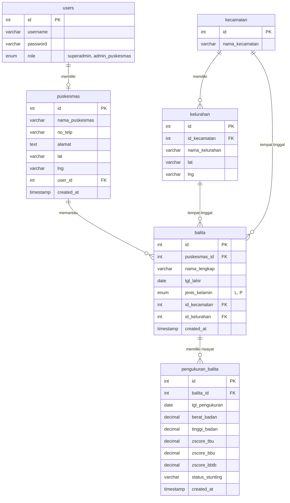

# DOKUMENTASI PROGRESS ANALISIS SISTEM: SIPSTU TOMOHON
*Sistem Informasi Pemantauan Stunting Kota Tomohon*

Dokumen ini berisi analisis menyeluruh terhadap struktur kode, basis data, alur kerja, fitur-fitur yang telah berhasil diimplementasikan, serta evaluasi kemajuan pembangunan sistem informasi **SIPSTU (Sistem Informasi Pemantauan Stunting)** Kota Tomohon.

---

## 1. Pendahuluan & Tujuan Sistem

**SIPSTU Tomohon** dirancang untuk membantu Dinas Kesehatan Kota Tomohon dan Puskesmas di seluruh wilayah Tomohon dalam memantau, mendata, dan menanggulangi stunting pada balita secara digital. 

Sistem ini memiliki tiga pilar fungsi utama:
1. **Pencatatan Pertumbuhan Balita**: Rekam data tumbuh kembang balita setiap bulan secara terstruktur.
2. **Kalkulator Z-Score WHO Dinamis**: Menghitung secara otomatis z-score pertumbuhan anak berdasarkan standar **WHO Child Growth Standards 2006**.
3. **Analisis Pemetaan & Prediksi (GIS & Machine Learning)**: Visualisasi geografis sebaran stunting di tingkat kelurahan/puskesmas serta implementasi kecerdasan buatan (Gaussian Naive Bayes) untuk memprediksi stunting berdasarkan data historis balita.

---

## 2. Arsitektur Teknologi & Framework

Sistem ini dibangun dengan mengintegrasikan beberapa modul teknologi sebagai berikut:

*   **Framework Backend Utama**: PHP 7.x/8.x menggunakan **CodeIgniter 3 (CI3)** dengan arsitektur MVC (Model-View-Controller).
*   **Database**: **MySQL / MariaDB** (`sipstu_db`) dengan library database bawaan CI3.
*   **Frontend UI/UX**: HTML5, Vanilla CSS dengan custom design system, dan integrasi Bootstrap/FontAwesome untuk antarmuka admin yang bersih.
*   **Sistem Geografis (GIS)**: JavaScript dengan library **Leaflet.js** untuk peta interaktif.
*   **Kalkulator Z-Score**: JavaScript murni di sisi client-side (`who_zscore.js`) menggunakan metode matematika **LMS (Box-Cox Power)** WHO 2006.
*   **Machine Learning (Kecerdasan Buatan)**: Python 3 dengan pustaka `scikit-learn` (Gaussian Naive Bayes), `pandas`, dan `mysql-connector-python` untuk pemrosesan prediksi stunting.

---

## 3. Analisis Skema Database (`sipstu_db`)

Berdasarkan berkas setup database (`setup_db.php` hingga `update_db5.php`), berikut adalah struktur tabel relasional yang digunakan oleh SIPSTU:

### Detail Deskripsi Tabel:
1.  **`users`**: Menyimpan kredensial pengguna sistem. Terdapat dua role utama: `superadmin` (Dinas Kesehatan) dan `admin_puskesmas` (petugas Puskesmas).
2.  **`puskesmas`**: Menyimpan profil data fisik puskesmas serta lokasi GPS (`lat`, `lng`) untuk kebutuhan visualisasi di peta. Terelasi ke tabel `users` untuk login admin puskesmas.
3.  **`kecamatan`** & **`kelurahan`**: Tabel wilayah administratif Tomohon. Tabel kelurahan menyimpan koordinat GPS (`lat`, `lng`) untuk pemetaan geografis stunting (GIS).
4.  **`balita`**: Menyimpan identitas balita terdaftar seperti nama lengkap, tanggal lahir, jenis kelamin, alamat wilayah, dan puskesmas yang bertanggung jawab.
5.  **`pengukuran_balita`**: Menyimpan catatan bulanan berat badan (BB), tinggi badan (TB), serta skor deviasi standar (Z-score) untuk indikator:
    *   `zscore_tbu`: Tinggi Badan menurut Umur (indikator stunting).
    *   `zscore_bbu`: Berat Badan menurut Umur (indikator gizi buruk/kurang).
    *   `zscore_bbtb`: Berat Badan menurut Tinggi Badan (indikator wasting/kurus).
    *   `status_stunting`: Klasifikasi akhir berdasarkan status HAZ/TBU (Normal, Stunting, atau Sangat Pendek).

---

## 4. Progress Analisis Implementasi Fitur ("Sampai Mana yang Dibuat")

Berikut adalah rincian fungsionalitas sistem yang sudah selesai didefinisikan dan diimplementasikan:

### A. Modul Autentikasi (`Auth.php` / `Auth_model.php` / `login.php`)
*   **Status: Selesai (100%)**
*   **Analisis**:
    *   Mendukung multi-user role.
    *   Jika role adalah `superadmin`, sistem mengarahkan ke dashboard utama dinas kesehatan (`welcome/index`).
    *   Jika role adalah `admin_puskesmas`, sistem membatasi data hanya untuk Puskesmas bersangkutan dan mengarahkan ke dashboard puskesmas (`welcome/puskesmas`).
    *   Keamanan menggunakan `password_verify()` PHP untuk mencocokkan password yang di-hash dengan algoritma `PASSWORD_DEFAULT` (bcrypt).

### B. Dashboard Dinas Kesehatan (Superadmin) (`Welcome.php` -> `index()`)
*   **Status: Selesai (100%)**
*   **Analisis**:
    *   Menampilkan ringkasan data kota Tomohon: total balita, total puskesmas, balita sudah diukur, dan belum diukur bulan ini.
    *   Menampilkan jumlah balita dengan klasifikasi Normal, Stunting, dan Sangat Pendek secara agregat kota.
    *   Menghitung tren status pertumbuhan balita 6 bulan terakhir dalam bentuk persen dan data riil.
    *   Menampilkan rekapitulasi data per-Puskesmas berupa tabel ringkasan stunting.
    *   Menampilkan notifikasi aktivitas pengukuran terbaru secara global.

### C. Dashboard & Laporan Puskesmas (`Welcome.php` -> `puskesmas()`, `laporan_kelurahan()`)
*   **Status: Selesai (100%)**
*   **Analisis**:
    *   Hanya menampilkan statistik dari balita yang berada di wilayah kerja puskesmas terkait.
    *   Menyajikan tren stunting bulanan (6 bulan terakhir) dan tabel rekapitulasi per kelurahan.
    *   Sistem pelaporan kelurahan memiliki 2 format tampilan:
        *   **Rekap**: Menghitung jumlah balita terdaftar, total diukur, cakupan pengisian data (%), prevalensi stunting (%), serta status kerawanan wilayah ("Tinggi" jika prevalensi >= 20%, "Sedang" jika >= 10%, "Aman" jika < 10%).
        *   **Detail**: Daftar nama-nama balita beserta hasil pengukuran lengkapnya untuk bulan yang dipilih.

### D. Manajemen Data Master (Superadmin & Admin Puskesmas)
*   **Status: Selesai (100%)**
*   *   **Puskesmas (`Puskesmas_admin.php`)**: Superadmin dapat mengelola data puskesmas (CRUD) sekaligus mendaftarkan akun pengelolanya menggunakan database transaction (`$this->db->trans_start()`) untuk menjamin konsistensi data antara tabel `users` dan `puskesmas`.
    *   **Wilayah (`Kelurahan_admin.php`)**: Superadmin memiliki akses penuh untuk mengelola master data kecamatan dan kelurahan beserta koordinat latitude/longitude untuk pemetaan Leaflet.js.
    *   **Balita (`Balita_admin.php`)**: Admin Puskesmas dapat melakukan CRUD data balita, mencatat riwayat pengukuran baru, dan mengubah identitas balita.

### E. GIS & Pemetaan Geografis (`Welcome.php` -> `peta_kelurahan()`, `peta_puskesmas()`)
*   **Status: Selesai (100%)**
*   **Analisis**:
    *   **Peta Puskesmas (Superadmin)**: Menampilkan marker puskesmas di peta Tomohon. Ketika marker diklik, Leaflet popup menampilkan data alamat, jumlah balita, dan rincian stunting puskesmas tersebut.
    *   **Peta Kelurahan (Puskesmas & Superadmin)**: Menampilkan marker sebaran kelurahan. Popup menampilkan total balita terdaftar, jumlah normal, stunting, dan sangat pendek pada kelurahan terpilih.

### F. Dynamic WHO Z-Score Engine (`who_zscore.js`)
*   **Status: Selesai (100%)**
*   **Analisis**:
    *   Ini adalah fitur inti yang sangat impresif. Daripada melakukan query database yang berat untuk mencari tabel referensi, z-score dihitung di sisi client secara dinamis menggunakan JavaScript saat petugas menginput data di halaman `tambah_pengukuran` atau `admin_puskesmas_tambah.php`.
    *   Menggunakan formula standar WHO LMS (Box-Cox power):
        *   Jika $L \neq 0$: $Z = \frac{(\frac{X}{M})^L - 1}{L \times S}$
        *   Jika $L = 0$: $Z = \frac{\ln(\frac{X}{M})}{S}$
    *   Mengimplementasikan koreksi WHO untuk nilai ekstrem ($|Z| > 3$ SD) untuk mencegah anomali data.
    *   Tabel referensi pertumbuhan WHO 2006 lengkap untuk HAZ/TBU, WAZ/BBU, dan WHZ/BBTB (baik untuk Laki-laki maupun Perempuan dari usia 0-60 bulan) didefinisikan sebagai konstanta array di dalam javascript.

### G. Modul Integrasi Machine Learning Naive Bayes (`Klasifikasi.php` & `stunting_nb.py`)
*   **Status: Selesai (100%)**
*   **Analisis**:
    *   Sistem memanggil script Python `stunting_nb.py` dari PHP menggunakan fungsi `shell_exec("python application/services/ml/stunting_nb.py")`.
    *   Script Python melakukan query langsung ke database MySQL (`sipstu_db`), melakukan kalkulasi usia balita dalam bulan, melakukan encoding jenis kelamin (L=1, P=0), dan melatih model **Gaussian Naive Bayes (GaussianNB)** dengan library `scikit-learn` menggunakan parameter: `usia_bulan`, `jk_encoded`, `berat_badan`, dan `tinggi_badan` sebagai fitur independen.
    *   Model dilatih dengan pembagian data latih (train) 80% dan data uji (test) 20%.
    *   Hasil keluaran Python dibaca oleh PHP dalam format JSON yang berisi performa metrik model (Akurasi, Presisi Macro, Recall, F-1 Score), metrik performa tiap kategori status stunting, serta sampel prediksi dari data riil terbaru.

---

## 5. Hasil Temuan Celah & Evaluasi Sistem (Gap Analysis)

Meskipun sistem telah memiliki fitur yang lengkap, terdapat beberapa celah teknis dan fungsional yang perlu diperhatikan untuk menjaga stabilitas dan performansi aplikasi di masa mendatang:

1.  **Kerentanan Validasi Kalkulasi Z-Score di Backend**:
    *   *Temuan*: Kalkulasi z-score dan status stunting dihitung di sisi frontend (`who_zscore.js`) lalu dikirim ke server melalui form POST HTTP untuk disimpan.
    *   *Risiko*: Jika pengguna mematikan JavaScript atau sengaja memanipulasi parameter form POST saat pengiriman data, backend PHP akan langsung menyimpan status stunting palsu tanpa validasi ulang di sisi backend.
2.  **Kredensial Database Hardcoded pada Script Python**:
    *   *Temuan*: Sambungan database pada `stunting_nb.py` ditulis secara manual (`host="localhost"`, `user="root"`, `database="sipstu_db"`, `password=""`).
    *   *Risiko*: Jika aplikasi dipindahkan ke lingkungan server produksi dengan konfigurasi database yang berbeda, proses pemanggilan ML akan mengalami kegagalan (database connection error) kecuali petugas memperbarui berkas Python tersebut secara manual.
3.  **Proses Training ML yang Kurang Efisien**:
    *   *Temuan*: Halaman hasil klasifikasi (`Klasifikasi.php`) melatih ulang (*re-training*) model Naive Bayes secara menyeluruh setiap kali halaman dibuka.
    *   *Risiko*: Seiring berjalannya waktu dan bertambahnya ribuan data balita, proses training yang sinkron ini akan memakan waktu lama, memperlambat pemuatan halaman (slow response time), bahkan memicu timeout pada server PHP.
4.  **Koordinat Peta Wilayah Tomohon**:
    *   *Temuan*: Hanya ada 6 kelurahan contoh yang diisi koordinat latitude/longitude secara default melalui script `update_db_kelurahan_coords.php`. Kelurahan lainnya belum memiliki koordinat GPS sehingga tidak akan muncul di peta sebaran stunting Leaflet.js.

---

## 6. Rekomendasi Langkah Pengembangan Selanjutnya (Next Steps)

Untuk meningkatkan kematangan sistem informasi SIPSTU Tomohon, berikut langkah-langkah yang direkomendasikan:

*   **Implementasi Validasi Z-score Sisi Server**: Porting fungsi kalkulator Z-score di `who_zscore.js` ke dalam Helper PHP di CodeIgniter, agar server dapat memvalidasi ulang z-score dan status stunting sebelum disimpan ke database.
*   **Penerapan Ekspor Konfigurasi DB ke Python**: Ubah `stunting_nb.py` untuk menerima kredensial database sebagai argumen command line dari PHP (`$command = "python stunting_nb.py $db_host $db_user $db_pass $db_name"`) agar tetap sinkron dengan file konfigurasi CodeIgniter (`application/config/database.php`).
*   **Model Serialization (Model Saving)**: Modifikasi script Python untuk melatih model secara berkala saja (misal: sekali sehari menggunakan cron job/task scheduler) lalu simpan model ke file biner (menggunakan `pickle` atau `joblib`). Halaman `Klasifikasi.php` kemudian hanya perlu membaca model biner yang sudah dilatih tersebut untuk melakukan prediksi cepat (*inference*), bukan melatih ulang dari nol.
*   **Pengisian Lengkap Koordinat Kelurahan**: Sediakan data koordinat latitude dan longitude lengkap untuk seluruh kelurahan di Kota Tomohon agar visualisasi peta GIS stunting berjalan maksimal dan tidak ada kelurahan yang terlewat.
